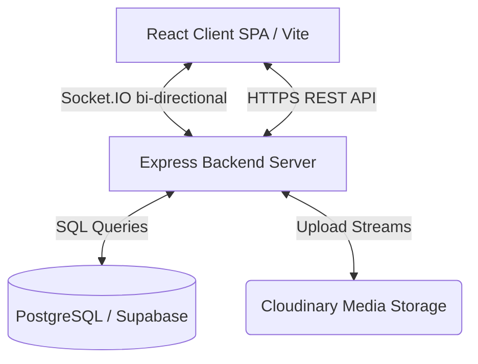

# System Architecture: NexusChat

## Overall Architecture
NexusChat consists of a React Single-Page Application (SPA) frontend and a Node.js Express REST and WebSocket backend, backed by PostgreSQL and Cloudinary.

## Frontend Structure (`client/`)
- **`src/components/`**: Reusable UI components
  - `auth/`: Login and registration components
  - `chat/`: Main workspace, message history, bubble elements, text inputs
  - `common/`: Reusable primitives (Buttons, Avatars, Modals, Tooltips)
  - `layout/`: Main app frames (Sidebar, Header, Notifications)
  - `profile/`: Settings, user profile view, and avatar upload
  - `voice/`: Voice rooms and WebRTC controls
- **`src/context/`**: State providers for application-wide states:
  - `AuthContext`: Session, tokens, user data, login/logout actions
  - `ChatContext`: Active room, room lists, message buffers, typing users
  - `SocketContext`: Initializing and holding the client socket instance
  - `ThemeContext`: Theme control
- **`src/hooks/`**: Custom React hooks (e.g. typing indicators, WebRTC hook, media uploads)
- **`src/services/`**: Axios configuration (`api.js`) featuring interceptors for JWT expiration auto-refresh.

## Backend Structure (`server/`)
- **`src/config/`**: Configuration files (PostgreSQL pool, Cloudinary, SQL schema definition)
- **`src/controllers/`**: Standard MVC controllers handling incoming REST endpoints
- **`src/middleware/`**: JWT validation, rate limiting, file upload size limits, and error handling
- **`src/models/`**: PostgreSQL query maps and schema operations
- **`src/routes/`**: Route definitions mapping endpoints to controllers
- **`src/services/`**: Business logic helpers (e.g., encryption utilities, room managers)
- **`src/sockets/`**: WebSockets message routing (room joins, typing status, voice/WebRTC signal forwarding)
- **`src/validators/`**: Joi validation schemas for incoming JSON bodies

## Database Schema Overview
The relational system is structured as follows:
- **`users`**: User credentials, profile picture details, online presence status.
- **`rooms`**: Direct message and group channels.
- **`room_members`**: Junction table mapping user memberships and roles (admin, member).
- **`messages`**: Multi-type chat messages (text, media attachment reference, reply references).
- **`media`**: Upload metadata linked to Cloudinary public IDs.
- **`message_read_by` & `message_delivered_to`**: Read & delivery receipts for messages.
- **`notifications`**: User alerts and real-time events.
